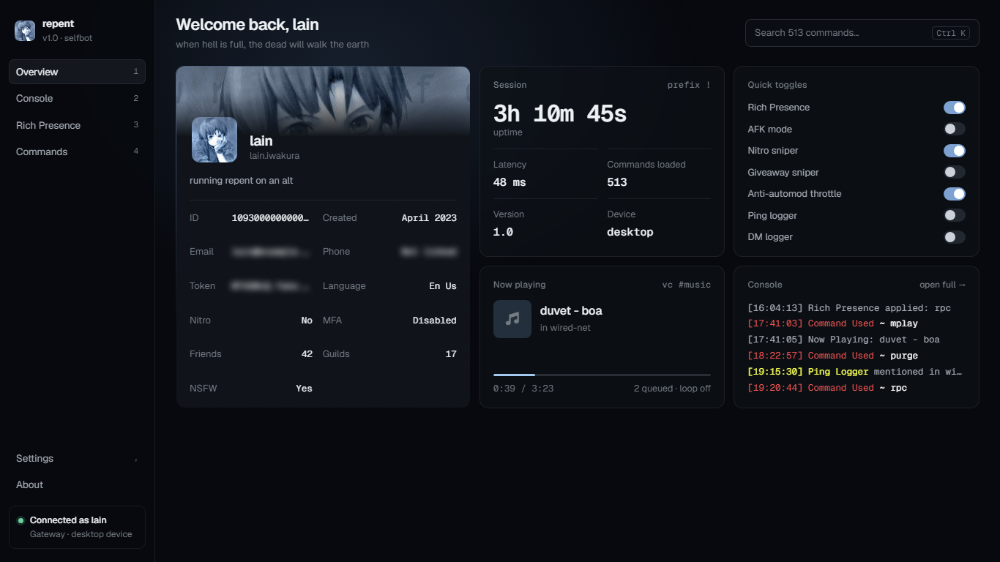
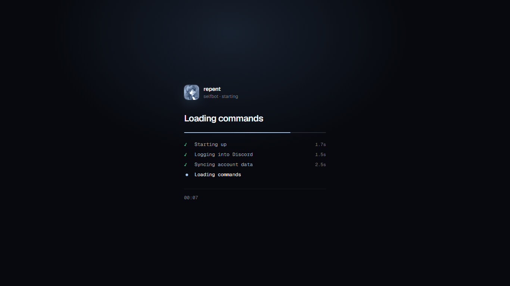
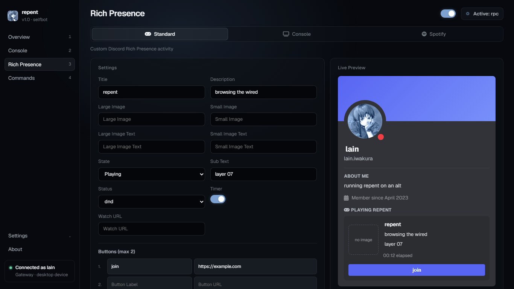
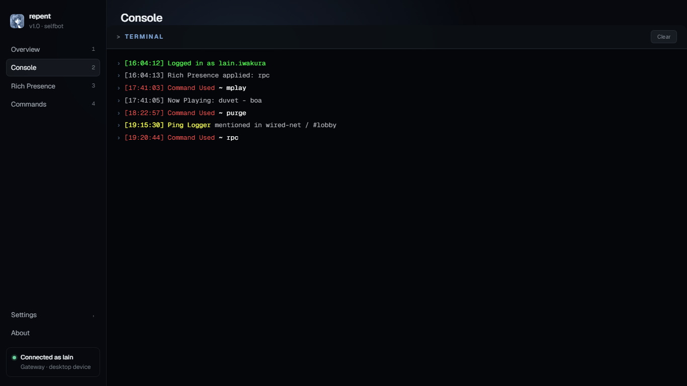
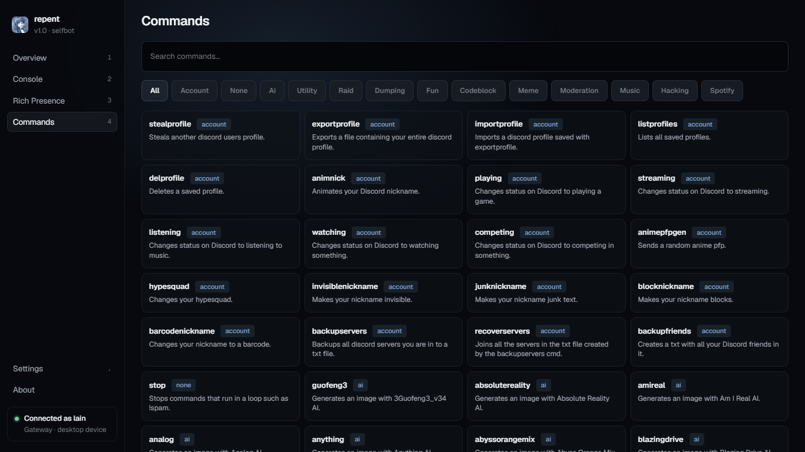
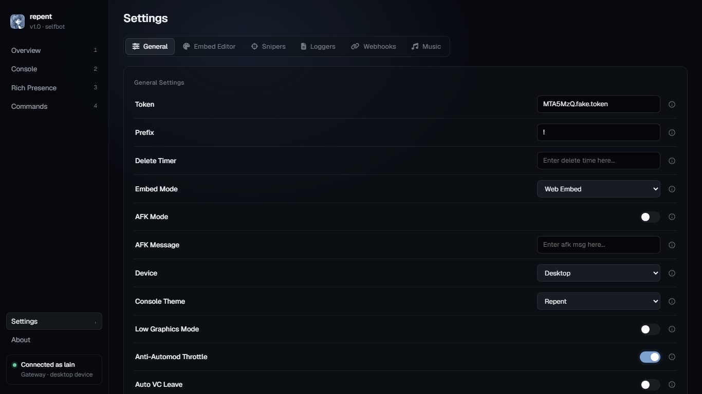
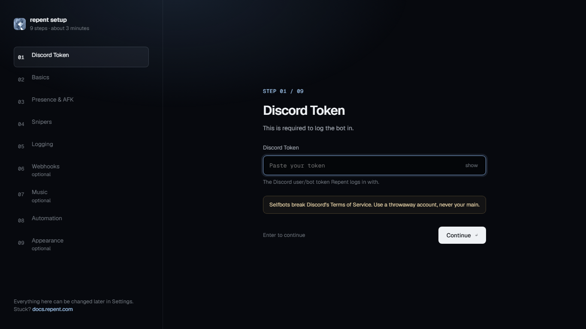

# repent.wtf is fork of [cheddlatron selfbot](https://github.com/Cheddlar/Cheddlatron-Source)

# Honorable mention
[Keira](https://github.com/KeiraOMG0): sponsoring claude code,cdn server and make this project doable\
[Grabify](https://github.com/Gr4bify/): retired developer of cheddlatron & helped me fix the bot\
[Cheddlar](https://github.com/Cheddlar): retired developer of cheddlatron\
Wraith: retired developer of cheddlatron

> **Disclaimer:** Selfbots (automating a normal user account instead of a proper bot account) violate [Discord's Terms of Service](https://discord.com/terms) and can get the account banned. This project is provided for educational purposes. Use it on an account you're willing to lose, and never on your primary account.

## Features

- **500+ commands** across `account`, `utility`, `fun`, `meme`, `moderation`, `ai`, `hacking`, `codeblock`, `raid`, `dumping`, `spotify`, and `music`
- **YouTube music playback** - `mplay`, `mskip`, `mstop`, `mqueue`, `mnowplaying`, `mloop`, `mautoplay`, `mvolume` stream real audio into a voice channel via [ytqueue](https://github.com/KeiraOMG0/ytqueue), with automatic cookie refresh via the [musicbot-cookie-sync](https://github.com/KeiraOMG0/musicbot-cookie-sync) Chrome extension
- **Music whitelist** - run repent on an alt and let your main (or friends) use the music commands, see [Music on an alt](#music-on-an-alt)
- **Dashboard** - opens in your browser at `http://localhost:8080`:
  - **Overview** - profile, session stats (uptime, latency, commands loaded), now playing, quick toggles and the latest console lines on one screen
  - **Console** - the full live console
  - **Rich Presence** - standard, console and Spotify presences with a live preview; changes apply instantly, no restart needed
  - **Commands** - searchable list of every command
  - **Settings** - general, embed editor, snipers, loggers, webhooks and music
- **Keyboard shortcuts** - `1`-`4` switch pages, `,` opens settings, `Ctrl+K` searches commands
- **First-run setup** - a step-by-step setup page that checks your token and webhooks before saving anything
- **Customization** - customize every thing you want with repent
- **Custom badges** - extra stuff i added because i have a lot of free time
- **Safe** - its an open sourced project ofc its gonna be safe

## Getting started

1. Install Python 3.10+ and run `pip install -r req.txt`
2. Run `python repent.py`
3. The first time, a setup page opens in your browser. Paste your token and go through the steps; everything except the token can be skipped and changed later in **Settings**
4. When setup finishes, the dashboard opens at `http://localhost:8080` and shows each startup step while it connects

When an update adds new settings, setup opens once more on the next start and only asks for the new ones.

## Requirements

- Python 3.10+ (tested on 3.11)
- Windows, macOS, or Linux (some conveniences — console font/codepage handling, `chcp`-equivalent fixes — are Windows-specific)
- A Discord account token
- [ffmpeg](https://ffmpeg.org/download.html) on your `PATH` (only needed for music playback)

## Music setup

Music commands (`mplay`, `mskip`, `mstop`, `mqueue`, `mnowplaying`, `mloop`, `mautoplay`, `mvolume`) need a couple of one-time setup steps:

1. Install [ffmpeg](https://ffmpeg.org/download.html) and make sure it's on your system `PATH`.
2. `pip install -r req.txt` (this pulls in `ytqueue` and `PyNaCl`, both required for voice audio).
3. (Optional, recommended) Load the cookie-sync Chrome extension so age/sign-in-gated YouTube videos keep working without manually re-exporting cookies:
   - Open `chrome://extensions`, enable **Developer mode**
   - Click **Load unpacked** and select `extras/musicbot-cookie-sync/extension/`
   - In the extension's options, set **Server origin** to `http://127.0.0.1:8999` and **Cookie domain** to `youtube.com`
   - Leave Chrome open (any window in the same profile keeps the poll loop alive)

Default volume and autoplay can be set under **Settings → Music**.

## Music on an alt

Discord only allows one voice connection per account, so repent can't play music to you on the same account you're listening with. To use it as a music bot:

1. Run repent on an alt account
2. In the alt's dashboard, open **Settings → Music** and add your main account's user ID to the **Music Whitelist** (comma separated for more than one)
3. Join a voice channel on your main and type `<prefix>mplay <song or url>` in a server the alt is in

The alt joins your voice channel and plays. Whitelisted users can only use the music commands (`mplay`, `mskip`, `mstop`, `mqueue`, `mnowplaying`, `mloop`, `mautoplay`, `mvolume`), nothing else on the alt.

## Previews
> sample account, not real data

> overview

> loading screen

> rich presence

> console

> commands

> settings

> first-run setup

